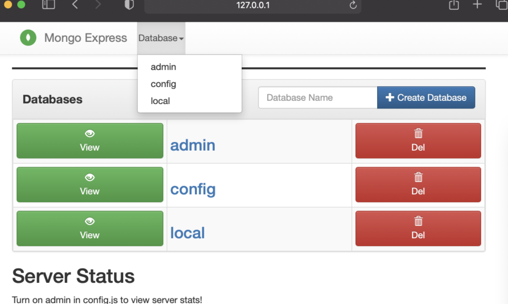

# Database

Details described below.

## Express service

Name: mongodb-express-service. Can be accessed after port tunneling localhost

```
kubectl port-forward mongo-express-68c4748bd6-9hd44 7777:8081
```



